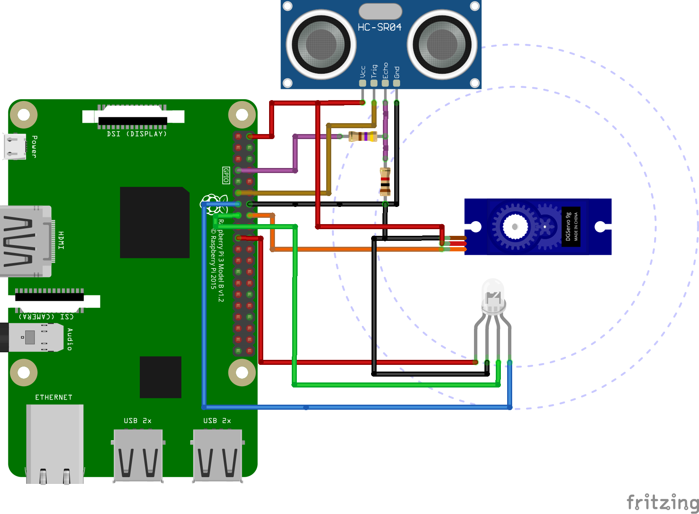

180° Range Search Detection Object 
===

Description 
---

Combining an ultrasonic Sensor and a Servo Motor with the platform Raspberry Pi 3 I will build a simple system that can search and detect an Object. This detection system will be moving in a range of 180° back and forward stopping when detecting the object within a distance between 6 and 8 inches. 

The Primary goals are:
- Implement ELMA into Raspberry Pi.
- Define a StateMachine called 'detection' with ELMA combining an ultrasonic sensor and a servo motor.
    </image>
- Utilize a library that allows me to use the bi-directional I/O pins in C++.
- Implement google test.

Resources
---
To complete this project I will use:

- Raspberry Pi 3 B+ 
- SG90 Micro Servo  
- Ultrasonic Module Distance Sensor HC-SR04

Milestones
---

1. Assemble all the components to connect to the raspberry -- 3/11
1. build the StateMachine 'detection' -- 3/13
1. build the Googletest for 'detection' -- 3/14
1. port the c++ libraries in to raspberry. --3/16
1. completing the API documentation. -- 3/17
1. completing final project and submission. --3/21

Updates
---

for the Milestones I have accomplish so far in the project are:

- Assemble all the components to connect the raspberry. here are the schematics of the conections 
  </image> </image>
