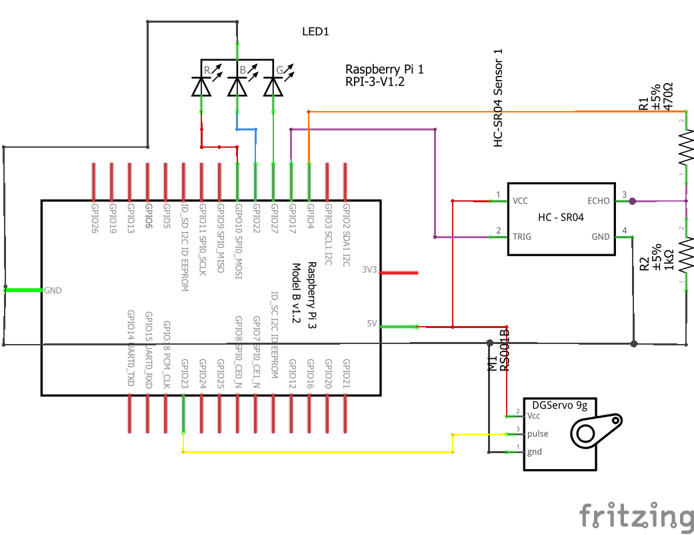
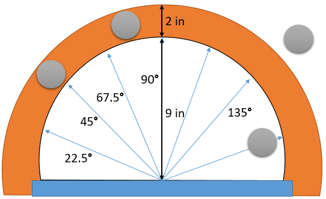

180° Range Search Detection Object 
===

Description 
---

Combining an ultrasonic Sensor and a Servo Motor with the platform Raspberry Pi 3 I will build a simple system that can search and detect an Object. This detection system will be moving in a range of 180° back and forward stopping when detecting the object within a distance between 9 and 11 inches. 

The Primary goals are:
- Implement ELMA into Raspberry Pi.
- Define a StateMachine called 'detection' with ELMA combining an ultrasonic sensor and a servo motor.
    </image>
- Utilize a library that allows me to use the bi-directional GPIO pins in C++.
- Implement google test.

Resources
---
To complete this project I will use:

- Raspberry Pi 3 B+ 
- SG90 Micro Servo  
- Ultrasonic Module Distance Sensor HC-SR04

Milestones
---

1. 【Done】Assemble all the components to connect to the raspberry -- 3/11
1. 【Done】build the StateMachine 'detection' -- 3/13
1. build the Googletest for 'detection' -- 3/14
1. 【Done】port the ELMA libraries in to raspberry. --3/16
1. completing the API documentation. -- 3/17
1. completing final project and submission. --3/21

Updates
---

For these Milestones I have accomplish so far in the project:

- Assemble all the components to connect the raspberry. Here are the schematics made on Fritzing software of the connections.  
  </image> </image>
  
  Also I added 1 LED with 3 colors to test that the wiringPi libraries are working with ELMA properly after compiling the code.
  
- Port the C++ libraries in to raspberry. I will change this Milestone instead of C++ libraries it will be the [ELMA]( https://github.com/klavinslab/elma/) and [WiringPi](http://www.wiringpi.com/) libraries since most of the C++ libraries are already included. The WiringPi library allows me to get access and control the GPIO pins from the programming language of C and C++. 
  
  I tried to install ELMA in both ways, first from the Docker file and second from the step by step of the Unix systems (e.g. Raspbian) instructions. 
  
  From the Docker file it successfully installed but with the inconvenient that it only run the Makefile and executes the code inside the Docker container not outside. Plus it is complex to control the GPIO pins from the container even if the libraries of WiringPi are installed and included. 
  
  In the second way following the instructions on how to install Elma in a Unix systems (e.g. Raspbian) it works great plus runs the code normally and lets me use the WiringPi library in the examples folder keeping in mind that on the Makefile you have to add the -lwiringPi like this.

        #Flags, Libraries and Includes
        CFLAGS      := -fsanitize=address -ggdb
        LIB         := -lgtest -lpthread -lasan -lelma -lssl -lcrypto -lwiringPi
        INCLUDE		:= -I..
        LIBDIR		:= -L../lib
        ELMALIB		:= ../lib/libelma.a

- Build the StateMachine 'detection': I Build my code base on the stopwach of [elma_project](https://github.com/klavinslab/elma_project.git) combining the features of accessing the time in milliseconds using it to increment the pulse wide modulation (PWM) in a range of 180° will help the program avoid using unnecessary loops or delays making it more efficient. Also I will use the User interface so I can start the program and see the distance of the object in centimeters and Inches plus the position of the servo in degrees.

  Another feature is the addition of [WiringPi](http://www.wiringpi.com/) Library to access and control the GPIO ports. here is a definition of the ports that are going to be use.

        #define BLUE 1
        #define GREEN 2 
        #define RED 3
        #define ECHO 0
        #define TRIGER 7
        #define PWM 4

        void Detection::setup(){
            wiringPiSetup () ;
            pinMode (BLUE, OUTPUT) ;
            pinMode (GREEN, OUTPUT) ;
            pinMode (RED, OUTPUT) ;
            pinMode (ECHO, INPUT) ;
            pinMode (TRIGER, OUTPUT) ;
            softPwmCreate (PWM, 0, 200) ;
        }
        
  Also I added a function setup() in detection to initialize all the GPIO Pins.

- Build the google testof detection: For the Practical test I will trace an area with the distance and angles of measurements, plus adding objects in different places so that the servo motor is stopping when the ultrasonic sensor measures the distance to that object Like the image below.

  </image>
  
  For the google test I will put objects in front of the HC-SR04 sensor in different distances so it can determine if the object is in the range of 9 and 11 and with that output the response if the motor should be running or stop. also if the user doesnt have an Ultrasonic sensor they can manually type the distance in a variable ot see the reponse.
